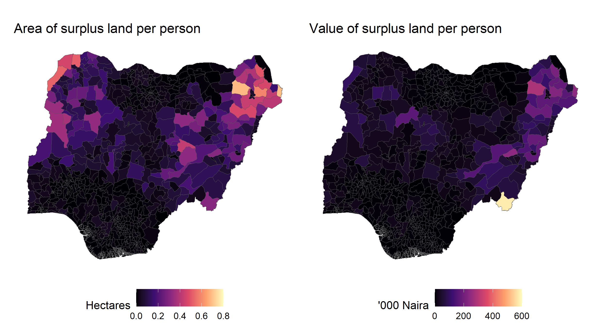

```{r setup, include=FALSE}
knitr::opts_chunk$set(knitr::opts_chunk$set(echo = F, eval = T, warning = F, message = F, comment = NA))
```

Onto the second post! This shows the results of one chapter of my PhD which I'm currently trying to get published. So there will just be a nice map with a bit of explanation in this post, and not too many spoilers.



These two maps show the area of surplus land (on the left), and the value of surplus land (on the right) for each Local Government Area (LGA) in Nigeria. They show that: 

1) There isn't much spare land going in most of Nigeria. 

2) This spare land is heavily concentrated in a few regions.

3) Available land is not the same as valuable land since some land is of lower quality due to different climates and soils.

The remainder of the post explains briefly how these maps fit into my PhD research.

Economists (among others) think that understanding scarcity is important to understanding the world. Scarcity is the basic economic problem. People have infinite wants and limited means. In a finite world where there are only so many resources, everybody cannot have everything.
To resolve this, societies develop institutions so that people do not fight so much over scarce resources. These ideas date back to classical scholars Locke, Hobbes, Smith and Hume - a topic for a later post...
As land becomes more scarce, property becomes more defined (through boundaries), better documented (through land titles), and more productive (through increased investment). 

My thesis tests whether this narrative explains property institutions in rural Nigeria. I conclude that it doesn't, and that context-specific politics and history are just as important as the economic logic of managing scarcity.
To test the theory in the first place, I needed to find a way of comparing the levels of scarcity in different parts of Nigeria. Scarcity is, however, remarkably difficult to quantify. 

The best proxy of rural land scarcity in the [existing literature](https://www.sciencedirect.com/science/article/pii/S0306919214000761) relies on measures of potentially available cropland. This is land which is not being used for cultivation at the moment that could be cultivated. The logic behind this is that land cannot be that scarce in a place if there is a lot of available land nearby which is not being used to produce food.

I used this literature as a starting point to model resource scarcity in Nigeria. I conducted an analysis of [land cover](http://www.esa-landcover-cci.org/), [protected areas](https://www.protectedplanet.net/en/thematic-areas/wdpa), [population distribution](https://blogs.worldbank.org/opendata/first-look-facebook-s-high-resolution-population-maps), [potential yields](https://agupubs.onlinelibrary.wiley.com/doi/full/10.1029/2007GB002947), [crop prices and input costs](https://microdata.worldbank.org/index.php/catalog/3557), to tailor the approach to Nigeria. The maps at the top are the result. Happy to answer any questions in the comments.