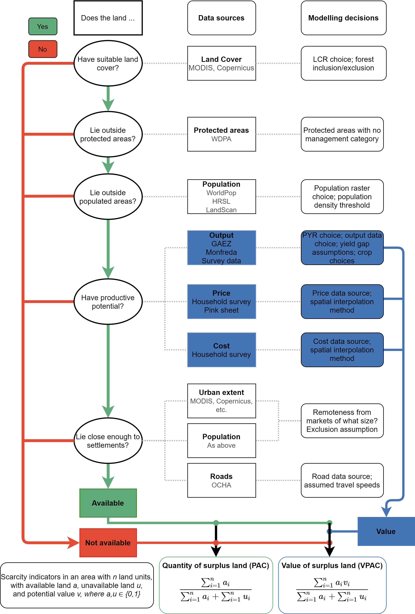

A big milestone for me -- last week I had my first paper accepted, in the journal [*Land Use Policy*](https://www.journals.elsevier.com/land-use-policy)! Through my PhD I have read and cited tens of fantastic articles from that journal, going back to the 1970s. So it is very exciting that I'll now be an author with them -- a year and a half and two major revisions since my first submission.

The paper is a methodological contribution to quantifying land scarcity.
Land scarcity is challenging to measure -- both conceptually and methodologically.
Different people have different understandings of what counts as scarce.
And the data needed to work out if land is scarce is scarce itself.
But, in spite of these issues, measuring land scarcity is important for agricultural policy and understanding food systems.

The article suggests a new measure which focuses on the *value* of potentially available cropland, rather than the *area* of available land. I argue that:

- Land quality matters when we talk about land scarcity in the context of sustainable development: someone with a one-hectare fertile farm experiences more plenty than another with a ten-hectare desert.
- Previous measures of land scarcity only partially include land quality.
- In the Nigerian case, where georeferenced survey data is plentiful, I develop a more tailored, value-based measure of land scarcity using reported agricultural production and costs.
- This measure is only very weakly correlated to area-based measures...
- ...suggesting that area-based measures, while easier to compute, may lead to misleading conclusions regarding scarcity.

Although I am biased (!) I do think that this is quite an important area.
In policy, knowing where land is plentiful helps governments to plan infrastructure, agricultural subsidies, land concessions and conservation initiatives.
And for theory, we can start to use new quantitative measures to address classic economic questions about how societies evolve in response to scarcity (see Smith, Hume, Marx, Demsetz and North).

My next steps - depending on interest - is to generalise the code used in the article and create an R package so that others can easily compute local land scarcity.

And for those interested - here is a flowchart showing the analysis process!

