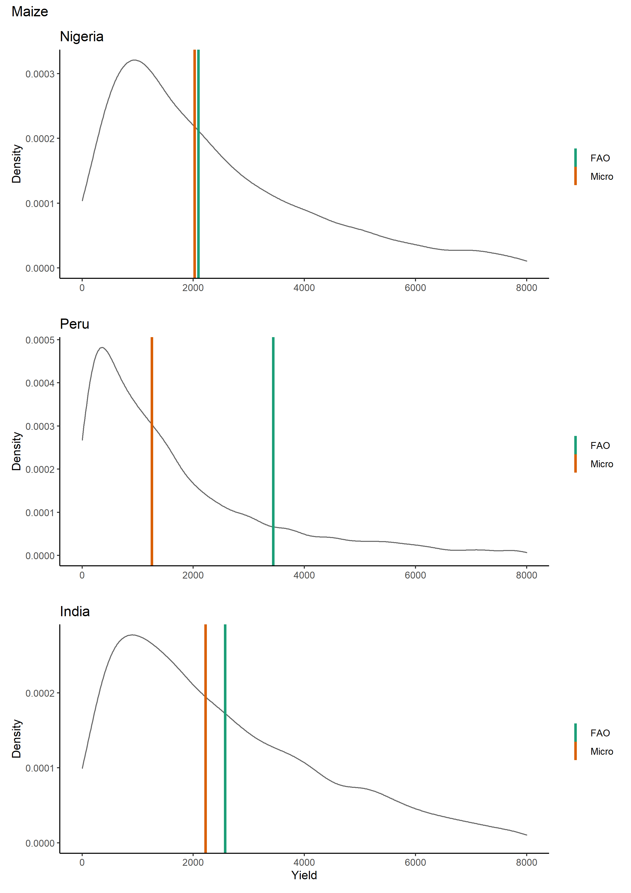

... this analysis was a chapter in my PhD and I'm currently reworking it into an article ...

There is a common view that African smallholder farmers are unproductive relative to the rest of the world. For one example among many, Jeffrey Sachs argues that...

> Africa needs a green revolution. Food yields on the continent are roughly one metric ton of grain per hectare of cultivated land, a figure little changed from 50 years ago and roughly one third of the yields achieved in the rest of the world. In low-income regions elsewhere in the world, including China and India, the introduction of high-yield seeds, fertiliser and small-scale irrigation boosted food productivity beginning in the mid-1960s and opened the escape route from extreme poverty for huge populations. A similar takeoff in sub-Saharan Africa is both an urgent priority and a real possibility. Until this change happens, Africa’s vast rural areas, which are home to two thirds of its population, will remain mired in poverty, hunger and high child mortality and will stay isolated from the world market economy [(Sachs)](http:
//doi.org/10.1038/scientificamerican0508-42).

For me, this intuitively should not be right.
Africa's population has grown at above Asia's population since the 1950s [(2.6% vs 1.7%)](https://www.statista.com/statistics/997040/world-population-by-continent-1950-2020/), which would be difficult without a comparable productivity increase.
I think there is a misconception arising because Sachs (and others) are not comparing like for like.

Smallholder farmers throughout the world produce food without significant investment in irrigation/fertilisers/seeds.
Larger farmers and commercial farms throughout the world typically invest in high-capital production.
There is a productivity difference between high-investment and low-investment agriculture.
And, if Africa has lower-intensity production, it might be fair to say that Africa has a productivity gap.
But, crucially, high-investment producers in Africa sell mainly to domestic markets.
These producers are not typically included in the sample frames for agricultural production data, which are focussed on 'households' and more typical subsistence farmers.

So, in the chapter I argue that the perceived Africa/Rest of the World yield gap is more a data problem than an inherent problem with African producers/environments/institutions.

I use ...

- comparable data (household survey, smallholder farmers); 
- comparable methods (GPS and recall surveys); 
- comparable crops (maize, rice, cassava and sorghum); and
- comparable output units (kg);

...

to compare yields for smallholder producers in three countries with comparable environments: Nigeria, Peru and India.

And, broadly speaking, I find that there is no appreciable productivity difference between smallholders in these three countries for these four crops.

So, I argue that to the extent that Nigeria is representative of Africa, and India/Peru are representative of the rest of the world (certainly a big stretch but not completely unreasonable!) the productivity gap argument is not supported by the data.

